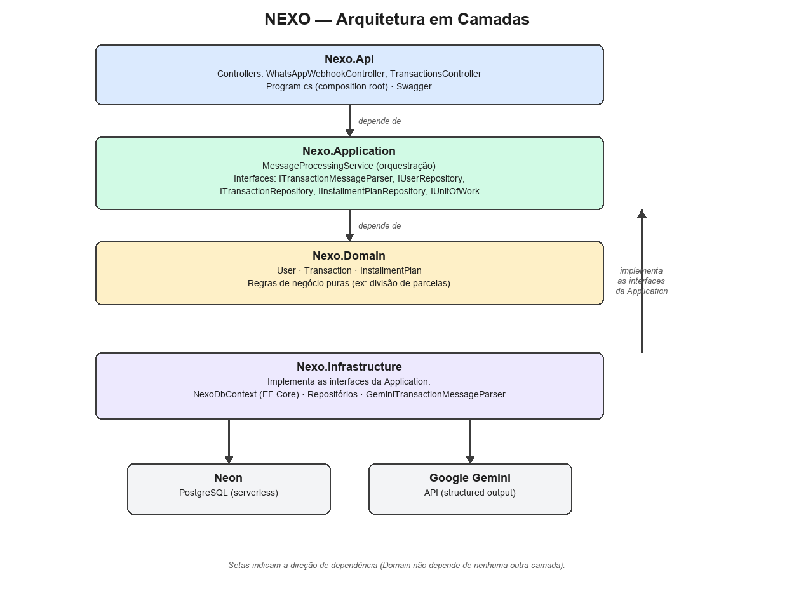

# NEXO — Assistente Financeiro Inteligente via WhatsApp

Trabalho de Conclusão de Curso (Bacharelado em Ciência da Computação — UNESP Rio Claro), disciplina *Projetos em Computação I*, 1º semestre de 2026.

**Autor:** André Augusto Costa Dionisio
**Orientador:** Prof. Denis Henrique Pinheiro Salvadeo (DEMAC)

## O que é

O NEXO é um assistente financeiro que permite registrar transações usando linguagem natural, tendo o WhatsApp como interface principal. Nesta primeira entrega, o foco é a base do sistema: arquitetura, backend, banco de dados e a primeira integração real com IA (não apenas o estudo da tecnologia, previsto originalmente só para esta etapa).

Exemplos de mensagens que o sistema já interpreta:

```
"gastei 30 reais no mercado"
"ganhei 500 reais hoje"
"comprei um notebook de 3000 reais em 10 parcelas"
```

## Arquitetura

Solução em 4 camadas, inspirada em Clean Architecture (porém deliberadamente simplificada — ver [ADR 0003](docs/decisions/0003-arquitetura-em-camadas-simplificada.md)):



| Projeto | Responsabilidade |
|---|---|
| `Nexo.Domain` | Entidades e regras de negócio puras (`User`, `Transaction`, `InstallmentPlan`) |
| `Nexo.Application` | Orquestração (`MessageProcessingService`) e abstrações (`ITransactionMessageParser`, repositórios) |
| `Nexo.Infrastructure` | EF Core + PostgreSQL (Neon), parser de mensagens via Gemini |
| `Nexo.Api` | Controllers REST, Swagger, composition root |

Modelo de dados: [docs/diagrams/er-diagram.png](docs/diagrams/er-diagram.png)
Visão do projeto (1º vs. 2º semestre): [docs/diagrams/roadmap-diagram.png](docs/diagrams/roadmap-diagram.png)

## Tecnologias

- .NET 10 / ASP.NET Core
- Entity Framework Core + Npgsql (PostgreSQL via [Neon](https://neon.tech), serverless)
- Google Gemini API (extração estruturada via *structured output* / JSON schema)
- xUnit + Moq (testes automatizados)
- Swagger / Swashbuckle

Decisões técnicas documentadas em [`docs/decisions/`](docs/decisions/) (ADRs), incluindo as alternativas consideradas para cada escolha.

## Como rodar localmente

Pré-requisitos: .NET 10 SDK, uma instância PostgreSQL (ex: Neon, gratuito), uma chave de API do Gemini (gratuita em [aistudio.google.com](https://aistudio.google.com)).

```bash
# Configurar segredos (nunca comitados)
dotnet user-secrets set "ConnectionStrings:Default" "<sua connection string>" --project src/Nexo.Api
dotnet user-secrets set "Gemini:ApiKey" "<sua chave>" --project src/Nexo.Api

# Aplicar migrations
dotnet ef database update --project src/Nexo.Infrastructure --startup-project src/Nexo.Api

# Rodar a API (Swagger disponível na raiz)
dotnet run --project src/Nexo.Api
```

### Testando o fluxo completo

O endpoint abaixo simula o recebimento de uma mensagem do WhatsApp (o contrato de entrada é inspirado no payload real do WhatsApp Cloud API — ver [ADR 0004](docs/decisions/0004-simulacao-do-webhook-whatsapp.md)):

```bash
curl -X POST http://localhost:5080/api/webhook/whatsapp \
  -H "Content-Type: application/json" \
  -d '{"from":"5511999999999","text":{"body":"gastei 30 reais no mercado"}}'
```

## Testes

```bash
dotnet test tests/Nexo.Tests
```

13 testes cobrindo a regra de divisão/arredondamento do parcelamento (`Nexo.Domain`) e a orquestração do `MessageProcessingService` com dependências mockadas (`Nexo.Application`).

Também há uma ferramenta de avaliação de acurácia do parser via Gemini (`tools/Nexo.GeminiEval`, não faz parte da suíte automática por depender de rede real) — resultado documentado em [`docs/avaliacao-gemini.md`](docs/avaliacao-gemini.md).

## Estrutura do repositório

```
src/
  Nexo.Domain/          entidades e regras de negócio
  Nexo.Application/     orquestração e abstrações
  Nexo.Infrastructure/  EF Core, repositórios, parser Gemini
  Nexo.Api/             controllers, Swagger, composition root
tests/
  Nexo.Tests/           testes automatizados (xUnit + Moq)
tools/
  Nexo.GeminiEval/      avaliação de acurácia do parser (manual)
docs/
  decisions/            ADRs (registros de decisão arquitetural)
  diagrams/              diagramas de arquitetura, modelo de dados e visão do projeto
  avaliacao-gemini.md    resultado da avaliação de acurácia
```

## Escopo e próximos passos

Esta entrega cobre a base do sistema. Ideias para o 2º semestre (levantadas em reunião de orientação com o Prof. Denis) estão detalhadas no diagrama de visão do projeto e no relatório de atividades da disciplina — entre elas: integração real com o WhatsApp Cloud API, módulo de IA conversacional completo, leitura de extratos bancários em PDF e projeção de capacidade de compra.
